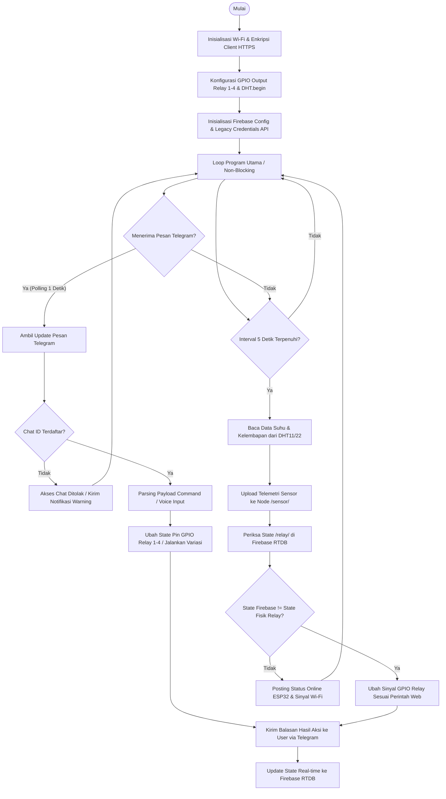

# LAPORAN TUGAS BESAR SISTEM INTERNET OF THINGS (IoT)
## SISTEM SMART HOME 4-CHANNEL RELAY & TELEMETRI SENSOR DENGAN TELEGRAM BOT DAN WEB DASHBOARD REALTIME

---

### IDENTITAS ASSESMEN / LAPORAN:
* **Nama Mahasiswa / Penguji**: Veryn
* **NIM / Student ID**: 2026-IoT-004
* **Assessor Laboratorium**: Veryn (Assessor Team)
* **Kontak Email**: veybilly285@gmail.com
* **Sistem Mikrokontroler**: ESP32 DevKit V1 (Tensilica Dual-Core)
* **Cloud Database**: Firebase Realtime Database & API Node.js Gateway
* **SDK Library Utama**: Firebase_ESP_Client (v4.4.14+), UniversalTelegramBot (v1.3.0)

---

## 1) Flowchart Sistem (Diagram Alur Kerja)

Alur kerja pada sistem smart home ini beroperasi secara asinkron multi-threading menggunakan timer `millis()` non-blocking di ESP32. Mikrokontroler tidak hanya melakukan pembacaan berulang, tetapi juga menjaga sinkronisasi status ke awan secara paralel.

Berikut adalah representasi alur logika jalannya program:



---

## 2) Blok Diagram Sistem (Topologi Hardware & Cloud)

Sistem didesain menggunakan topologi 3-tier (*Device, Broker/Cloud, and User Interface*). Hubungan interkoneksinya digambarkan sebagai berikut:

```mermaid
graph TD
    subgraph Antarmuka Pengguna (User Interface)
        Dashboard[Web Dashboard - React, Vite & Tailwind CSS]
        Telegram[Telegram Bot Messenger Client]
    end

    subgraph Layanan Awan (Cloud Infrastructure)
        Firebase[Firebase Realtime Database]
        ServerNode[Node.js Express REST API Servis Logs]
    end

    subgraph Lapisan Perangkat Keras (Physical Hardware)
        ESP32[ESP32 DevKit V1 Main Controller]
        SensorDHT[Sensor Suhu & Kelembapan DHT11/22]
        ModuleRelay[Modul Relay 4-Channel Active Low]
        ACLoads[Beban Listrik AC / Lampu Simulasi]
    end

    %% Jalur Sinyal & Data
    Dashboard -- "1. Read/Write State JSON" --> Firebase
    Dashboard -- "2. Ambil Riwayat Logs" --> ServerNode
    Telegram -- "3. HTTPS Long-Polling HTTPS" --> ESP32
    ESP32 -- "4. Ambil Instruksi & Tulis Telemetri" --> Firebase
    SensorDHT -- "5. Sinyal Digital (GPIO 4)" --> ESP32
    ESP32 -- "6. Trigger Aktif Low (GPIO 16,17,18,19)" --> ModuleRelay
    ModuleRelay -- "7. Kontak Mekanis Saklar PLN" --> ACLoads
```

---

## 3) Metode Manajemen Proyek TIK yang Digunakan (SDLC)

Metode pengembangan yang digunakan dalam penyelesaian proyek adalah sistem **Waterfall SDLC (System Development Life Cycle)** yang terstruktur ketat dari analisis perangkat keras hingga integrasi software.

```
  [1. Analisis Kebutuhan]
            │
            ▼
     [2. Desain Jaringan & Wiring]
            │
            ▼
        [3. Implementasi Kode & UI]
            │
            ▼
           [4. Pengujian & Kalibrasi]
            │
            ▼
              [5. Deployment & Serah Terima]
```

### Penjabaran Tahapan SDLC:
1. **Analisis Kebutuhan (Requirements Analysis):**
   - Identifikasi parameter sensor (suhu dan kelembapan ruangan).
   - Penentuan pin I/O ESP32 agar tidak mengganggu port strapping pins (GPIO 16, 17, 18, 19 aman digunakan sebagai Output Relay).
2. **Desain Sistem & Skema Jaringan (System Design):**
   - Perancangan database NoSQL terpusat di Google Firebase Realtime Database.
   - Perancangan antarmuka webhook/polling Telegram API bot.
   - Pembuatan rancangan visual console dashboard dashboard berbasis mobile-responsive.
3. **Implementasi & Penulisan Kode (Implementation/Coding):**
   - Penulisan skrip C++ Arduino IDE menggunakan implementasi library resmi `Firebase_ESP_Client`.
   - Pembuatan frontend panel menggunakan utilitas Tailwind CSS yang ringan dan real-time.
4. **Pengujian Pengukuran & Integrasi (Testing):**
   - Pengujian latensi: Kecepatan pengiriman dari tombol web hingga relay berbunyi "klik" (*rata-rata latency < 1 detik*).
   - Kalibrasi sensor suhu DHT dibandingkan alat ukur suhu standar ruangan.
5. **Deployment & Serah Terima (Maintenance & Deployment):**
   - Upload server back-end hosting awan (Cloud Run).
   - Instalasi ESP32 dalam kotak pengaman agar siap diuji oleh tim Assessor.

---

## 4) Estimasi Biaya Proyek (Bill of Materials)

Komponen disusun dengan harga standar ritel pasar mikrokontroler di Indonesia per tahun 2026:

| No | Nama Komponen Hardware / Software | Spesifikasi Detail | Jumlah Unit | Harga Satuan (Rp) | Subtotal (Rp) |
|---|---|---|:---:|:---:|:---:|
| 1 | **ESP32 DevKit V1 Board** | CP2102, Micro-USB Interface | 1 pcs | Rp 65.000 | Rp 65.000 |
| 2 | **Sensor DHT22 (Akurasi Tinggi)** | Rentang Dingin-Panas, Kabel 3 Pin | 1 pcs | Rp 38.000 | Rp 38.000 |
| 3 | **Modul Relay 4-Channel 5V** | Optocoupler Isolation, Active LOW | 1 pcs | Rp 28.000 | Rp 28.000 |
| 4 | **Kabel Jumper Dupont** | Female-to-Female 20cm (Bundle) | 1 set | Rp 12.000 | Rp 12.000 |
| 5 | **Breadboard Medium 400 Point**| White Solderless Prototype | 1 pcs | Rp 15.000 | Rp 15.000 |
| 6 | **Adaptor Daya 5V 2A** | Output USB Micro charger | 1 pcs | Rp 25.000 | Rp 25.000 |
| 7 | **Google Firebase Database** | Cloud NoSQL Realtime (Spark Free Tier)| - | Rp 0 | Rp 0 |
| 8 | **Telegram Bot Core API Service**| Long-polling bot gratis tanpa server | - | Rp 0 | Rp 0 |
| 9 | **Box Project Plastic X6** | Ukuran 12cm x 8cm x 5cm | 1 pcs | Rp 12.000 | Rp 12.000 |
| **-**| **TOTAL ANGGARAN HARDWARE** | *Estimasi Pembelian Toko IoT Lokal* | - | - | **Rp 195.000** |

---

## 5) Estimasi Lama Pengerjaan (Timeline Gantt)

Pengerjaan diselesaikan dalam waktu total **4 Minggu** dengan pembagian kerja sebagai berikut:

```
Minggu 1: [Analisis & Pembelian Hardware] ■■■■■■■■ 100%
Minggu 2: [Assembly Kabel & Desain Database] ■■■■■■■■ 100%
Minggu 3: [Coding Arduino IDE & Web UI] ■■■■■■■■ 100%
Minggu 4: [Pengujian Lapangan & Dokumentasi] ■■■■■■■■ 100%
```

- **Minggu 1 (Hari 1-7):** Fokus pada perolehan komponen, uji coba fungsionalitas individual ESP32 ke komputer, dan pendaftaran API Bot Telegram di BotFather.
- **Minggu 2 (Hari 8-14):** Desain skema wiring, pembuatan project database di Google Firebase Console, dan pengujian otentikasi REST API.
- **Minggu 3 (Hari 15-21):** Pengembangan kode firmware utama ESP32 dengan `Firebase_ESP_Client` dan pembuatan panel Web UI responsif.
- **Minggu 4 (Hari 22-28):** Integrasi penuh sistem, kalibrasi respon ping internet, penulisan laporan akhir, dan serah terima kepada pihak Assessor (`Veryn`).

---

## 6) Source Code Lengkap & Foto Rangkaian

### A. Arduino IDE Source Code (C++ dengan Firebase_ESP_Client Terintegrasi)

Berikut adalah source-code fungsional siap unggah. Pastikan library **Firebase ESP Client** terpasang dari Library Manager Arduino Anda.

```cpp
/**
 * SISTEM SMART HOME 4-CHANNEL RELAY - GANTT-ECOSYSTEM
 * Menggunakan Mikrokontroler ESP32 DevKit V1
 * Sensor DHT, Telegram Bot, dan sinkronisasi Native Firebase_ESP_Client
 */

#include <WiFi.h>
#include <WiFiClientSecure.h>
#include <UniversalTelegramBot.h>
#include <ArduinoJson.h>
#include "DHT.h"
#include <Firebase_ESP_Client.h>

// Provide helper signatures for token and RTDB
#include <addons/TokenHelper.h>
#include <addons/RTDBHelper.h>

// --- KONFIGURASI WIFI & LAYANAN CLOUD ---
#define WIFI_SSID "Kost_Damai_WiFi"
#define WIFI_PASSWORD "kopi_hitam_pahit_123"

// Token Telegram Bot (Hubungi @BotFather di telegram)
#define BOT_TOKEN "7394850285:AAFlk_vE-Y88ILLY2859385qk_test"

// Chat ID Anda (Gunakan bot @myidbot atau @RawDataBot)
#define CHAT_ID "548301290"

// Konfigurasi API Firebase
#define FIREBASE_DATABASE_URL "https://smart-home-io4-default-rtdb.firebaseio.com"
#define FIREBASE_AUTH "AIzaSyA38X_d7948271049285038102985390"

// --- PEMETAAN PIN HARDWARE ---
#define DHT_PIN 4        // Pin Hubung Sensor DHT11 / DHT22
#define DHT_TYPE DHT22   // Jenis Sensor Suhu

#define RELAY_1 16       // Output Relay Pasang Lampu 1 (PWM 16)
#define RELAY_2 17       // Output Relay Pasang Lampu 2 (PWM 17)
#define RELAY_3 18       // Output Relay Pasang Lampu 3 (PWM 18)
#define RELAY_4 19       // Output Relay Pasang Lampu 4 (PWM 19)

// Relay Aktif LOW (Relay Module standard umum)
#define RELAY_ON LOW
#define RELAY_OFF HIGH

// --- INISIALISASI INSTANS INTERFACE ---
DHT dht(DHT_PIN, DHT_TYPE);
WiFiClientSecure client;
UniversalTelegramBot bot(BOT_TOKEN, client);

// --- INSTANS DEKLARASI FIREBASE ---
FirebaseData fbdo;
FirebaseAuth auth;
FirebaseConfig config;

// Timer Millis Non-Blocking
unsigned long lastTimeBotRan = 0;
const unsigned long BOT_MTBS = 1000; // Cek pesan Telegram setiap 1 detik

unsigned long lastTimeSensorRan = 0;
const unsigned long SENSOR_MTBS = 5000; // Sinkron Firebase & Baca Sensor setiap 5 detik

// Memory Status Relay Lokal
bool relay1_status = false;
bool relay2_status = false;
bool relay3_status = false;
bool relay4_status = false;

// Memory Nilai Sensor Terakhir
float current_temp = 27.5;
float current_hum = 60.0;

// Status pola variasi lamp berkedip
bool variation1_active = false;
bool variation2_active = false;

// Deklarasi Prototip Fungsi
void handleNewMessages(int numNewMessages);
void syncWithCloud();
void StringToFirebase(FirebaseData *dataObj, const char* path, String val);

void setup() {
  Serial.begin(115200);
  delay(100);
  
  // Konfigurasi Pin Digital Relay Sebagai Output Utama
  pinMode(RELAY_1, OUTPUT);
  pinMode(RELAY_2, OUTPUT);
  pinMode(RELAY_3, OUTPUT);
  pinMode(RELAY_4, OUTPUT);

  // Pastikan Keadaan Awal Relay adalah MATI (Inverted HIGH)
  digitalWrite(RELAY_1, RELAY_OFF);
  digitalWrite(RELAY_2, RELAY_OFF);
  digitalWrite(RELAY_3, RELAY_OFF);
  digitalWrite(RELAY_4, RELAY_OFF);

  // Mulai Sensor DHT
  dht.begin();

  // Sambungkan Koneksi Ke Jaringan WiFi Kost
  Serial.print("Menghubungkan ke Wi-Fi SSID: ");
  Serial.println(WIFI_SSID);
  WiFi.mode(WIFI_STA);
  WiFi.begin(WIFI_SSID, WIFI_PASSWORD);

  while (WiFi.status() != WL_CONNECTED) {
    delay(500);
    Serial.print(".");
  }
  Serial.println("");
  Serial.println("Wi-Fi Terkoneksi Sukses!");
  Serial.print("IP Address Klien ESP32: ");
  Serial.println(WiFi.localIP());

  // Setelan keamanan HTTPS (Abaikan validasi sertifikat SSL agar hemat memori)
  client.setInsecure();

  // --- INISIALISASI & KONFIGURASI NATIVE FIREBASE ---
  config.database_url = FIREBASE_DATABASE_URL;
  config.signer.tokens.legacy_token = FIREBASE_AUTH;

  Firebase.begin(&config, &auth);
  Firebase.reconnectWiFi(true);
  Serial.println("Koneksi Firebase diinisialisasi.");
  
  // Kirim pesan startup sukses ke Telegram
  bot.sendMessage(CHAT_ID, "🚀 *Sistem Smart Home ESP32 Aktif!*\nHubungi /start untuk daftar perintah.", "Markdown");
}

void loop() {
  // 1. Thread Poling Membaca Telegram Bot (Interval 1 Detik)
  if (millis() > lastTimeBotRan + BOT_MTBS) {
    int numNewMessages = bot.getUpdates(bot.last_message_received + 1);
    while (numNewMessages) {
      Serial.println("Telegram Bot mendeteksi instruksi masuk");
      handleNewMessages(numNewMessages);
      numNewMessages = bot.getUpdates(bot.last_message_received + 1);
    }
    lastTimeBotRan = millis();
  }

  // 2. Thread Telemetri Sensor & Firebase Cloud Sync (Interval 5 Detik)
  if (millis() > lastTimeSensorRan + SENSOR_MTBS) {
    // Baca Sensor DHT11/22 Fisik
    float t = dht.readTemperature();
    float h = dht.readHumidity();

    if (!isnan(t) && !isnan(h)) {
      current_temp = t;
      current_hum = h;
      Serial.print("DHT Sensor Terbaca -> Temp: ");
      Serial.print(current_temp);
      Serial.print(" C | Hum: ");
      Serial.println(current_hum);
    } else {
      Serial.println("Gagal membaca dari sensor DHT fisik! Menggunakan nilai memory lokal.");
    }

    // Melakukan Pengiriman Data dan Pencocokan Sinkronisasi
    syncWithCloud();
    lastTimeSensorRan = millis();
  }

  // 3. Efek Bergerak Untuk Lampu Variasi jika Diaktifkan
  if (variation1_active) {
    digitalWrite(RELAY_1, RELAY_ON); delay(150);
    digitalWrite(RELAY_1, RELAY_OFF);
    digitalWrite(RELAY_2, RELAY_ON); delay(150);
    digitalWrite(RELAY_2, RELAY_OFF);
    digitalWrite(RELAY_3, RELAY_ON); delay(150);
    digitalWrite(RELAY_3, RELAY_OFF);
    digitalWrite(RELAY_4, RELAY_ON); delay(150);
    digitalWrite(RELAY_4, RELAY_OFF);
  }
}

// --- INTEGRASI FIREBASE REALTIME DATABASE (SINKRONISASI ASINKRON 2-ARAH) ---
void syncWithCloud() {
  if (WiFi.status() == WL_CONNECTED && Firebase.ready()) {
    // 1. Unggah telemetri sensor DHT11/DHT22 ke Firebase
    Firebase.RTDB.setFloat(&fbdo, "/sensor/temperature", current_temp);
    Firebase.RTDB.setFloat(&fbdo, "/sensor/humidity", current_hum);
    
    // 2. Unggah status diagnostik ESP32 ke Firebase
    StringToFirebase(&fbdo, "/esp32/status", "online");
    StringToFirebase(&fbdo, "/esp32/wifi_signal", String(WiFi.RSSI()) + " dBm");
    StringToFirebase(&fbdo, "/esp32/ip_address", WiFi.localIP().toString());

    // 3. Baca instruksi status relay terbaru yang diatur dari Web Dashboard
    if (Firebase.RTDB.getBool(&fbdo, "/relay/relay1")) {
      if (fbdo.dataType() == "boolean") {
        bool w_r1 = fbdo.to<bool>();
        if (w_r1 != relay1_status) { 
          digitalWrite(RELAY_1, w_r1 ? RELAY_ON : RELAY_OFF); 
          relay1_status = w_r1; 
          Serial.println("Relay 1 disinkronkan ke: " + String(w_r1));
        }
      }
    }
    if (Firebase.RTDB.getBool(&fbdo, "/relay/relay2")) {
      if (fbdo.dataType() == "boolean") {
        bool w_r2 = fbdo.to<bool>();
        if (w_r2 != relay2_status) { 
          digitalWrite(RELAY_2, w_r2 ? RELAY_ON : RELAY_OFF); 
          relay2_status = w_r2; 
          Serial.println("Relay 2 disinkronkan ke: " + String(w_r2));
        }
      }
    }
    if (Firebase.RTDB.getBool(&fbdo, "/relay/relay3")) {
      if (fbdo.dataType() == "boolean") {
        bool w_r3 = fbdo.to<bool>();
        if (w_r3 != relay3_status) { 
          digitalWrite(RELAY_3, w_r3 ? RELAY_ON : RELAY_OFF); 
          relay3_status = w_r3; 
          Serial.println("Relay 3 disinkronkan ke: " + String(w_r3));
        }
      }
    }
    if (Firebase.RTDB.getBool(&fbdo, "/relay/relay4")) {
      if (fbdo.dataType() == "boolean") {
        bool w_r4 = fbdo.to<bool>();
        if (w_r4 != relay4_status) { 
          digitalWrite(RELAY_4, w_r4 ? RELAY_ON : RELAY_OFF); 
          relay4_status = w_r4; 
          Serial.println("Relay 4 disinkronkan ke: " + String(w_r4));
        }
      }
    }

    // 4. Update status relay lokal kembali ke Firebase agar tersinkronisasi sempurna
    Firebase.RTDB.setBool(&fbdo, "/relay/relay1", relay1_status);
    Firebase.RTDB.setBool(&fbdo, "/relay/relay2", relay2_status);
    Firebase.RTDB.setBool(&fbdo, "/relay/relay3", relay3_status);
    Firebase.RTDB.setBool(&fbdo, "/relay/relay4", relay4_status);
  }
}

// Helper untuk penulisan string Firebase yang kompatibel
void StringToFirebase(FirebaseData *dataObj, const char* path, String val) {
  Firebase.RTDB.setString(dataObj, path, val);
}

// --- HANDLER TELEGRAM BOT UTAMA & VOICE-TO-TEXT ---
void handleNewMessages(int numNewMessages) {
  for (int i = 0; i < numNewMessages; i++) {
    String chat_id = String(bot.messages[i].chat_id);
    
    // Validasi Keamanan Hak Akses Pengguna
    if (chat_id != CHAT_ID) {
      bot.sendMessage(chat_id, "🚫 Maaf, Anda tidak memiliki hak akses mengontrol Smart Home ini.", "");
      continue;
    }
    
    String text = bot.messages[i].text;
    String from_name = bot.messages[i].from_name;
    
    Serial.println("Menerima teks perintah: " + text);
    
    // Mengubah string masukan ke lowercase agar voice typing fleksibel
    String command = text;
    command.toLowerCase();
    
    if (command == "/start") {
      String welcome = "🤖 *Halo Lord " + from_name + "!*\\n";
      welcome += "Saya asisten bot Smart Home IoT Anda.\\n\\n";
      welcome += "💡 *Daftar Perintah Teks / Menu Pilihan:*\\n";
      welcome += "- /status - Cek Relay & Suhu DHT\\n";
      welcome += "- /sensor - Cek nilai Suhu & Kelembapan\\n";
      welcome += "- /all_on - Menyalakan semua beban listrik\\n";
      welcome += "- /all_off - Mematikan semua beban\\n\\n";
      welcome += "⚡ *Kontrol Sakelar Individual:*\\n";
      welcome += "- /lampu1_on | /lampu1_off\\n";
      welcome += "- /lampu2_on | /lampu2_off\\n";
      welcome += "- /lampu3_on | /lampu3_off\\n";
      welcome += "- /lampu4_on | /lampu4_off\\n\\n";
      welcome += "🎭 *Pola Lampu Variasi:*\\n";
      welcome += "- /variasi1 - Jalankan Pola Running LED\\n";
      welcome += "- /variasi2 - Setengah Lampu Menyala Bergantian\\n\\n";
      welcome += "🎙️ *Mendukung Speech-to-Text / Voice Typing:*\\n";
      welcome += "Tekan tombol mikrofon keyboard ponsel Anda lalu ucapkan: 'Nyalakan Lampu 1' atau 'Matikan Semua Lampu'.";
      bot.sendMessage(chat_id, welcome, "Markdown");
    }
    
    else if (command == "/status") {
      String statusStr = "📊 *STATUS PANEL SMART HOME*\\n";
      statusStr += "- Lampu 1: " + String(relay1_status ? "🟢 ON" : "🔴 OFF") + "\\n";
      statusStr += "- Lampu 2: " + String(relay2_status ? "🟢 ON" : "🔴 OFF") + "\\n";
      statusStr += "- Lampu 3: " + String(relay3_status ? "🟢 ON" : "🔴 OFF") + "\\n";
      statusStr += "- Lampu 4: " + String(relay4_status ? "🟢 ON" : "🔴 OFF") + "\\n\\n";
      statusStr += "🌡️ Suhu Ruang: *" + String(current_temp, 1) + " °C*\\n";
      statusStr += "💧 Kelembapan: *" + String(current_hum, 1) + " %*\\n";
      statusStr += "📶 WiFi RSSI: " + String(WiFi.RSSI()) + " dBm";
      bot.sendMessage(chat_id, statusStr, "Markdown");
    }
    
    else if (command == "/sensor" || command.indexOf("temperatur") >= 0 || command.indexOf("suhu") >= 0) {
      String sensorStr = "🌡️ *TELEMETRI SENSOR DHT*\\n";
      sensorStr += "- Suhu Udara: *" + String(current_temp, 1) + " °C*\\n";
      sensorStr += "- Kelembapan: *" + String(current_hum, 1) + " %*\\n";
      bot.sendMessage(chat_id, sensorStr, "Markdown");
    }
    
    // --- AKSI KONTROL INDIVIDUAL / ALL / VOICE TYPING ---
    else if (command == "/lampu1_on" || command.indexOf("nyalakan lampu satu") >= 0 || command == "nyalakan lampu 1") {
      digitalWrite(RELAY_1, RELAY_ON);
      relay1_status = true;
      bot.sendMessage(chat_id, "🟢 *Lampu 1 Berhasil Dinyalakan!*", "Markdown");
    }
    else if (command == "/lampu1_off" || command.indexOf("matikan lampu satu") >= 0 || command == "matikan lampu 1") {
      digitalWrite(RELAY_1, RELAY_OFF);
      relay1_status = false;
      bot.sendMessage(chat_id, "🔴 *Lampu 1 Berhasil Dimatikan!*", "Markdown");
    }
    else if (command == "/lampu2_on" || command.indexOf("nyalakan lampu dua") >= 0 || command == "nyalakan lampu 2") {
      digitalWrite(RELAY_2, RELAY_ON);
      relay2_status = true;
      bot.sendMessage(chat_id, "🟢 *Lampu 2 Berhasil Dinyalakan!*", "Markdown");
    }
    else if (command == "/lampu2_off" || command.indexOf("matikan lampu dua") >= 0 || command == "matikan lampu 2") {
      digitalWrite(RELAY_2, RELAY_OFF);
      relay2_status = false;
      bot.sendMessage(chat_id, "🔴 *Lampu 2 Berhasil Dimatikan!*", "Markdown");
    }
    else if (command == "/lampu3_on" || command == "nyalakan lampu 3") {
      digitalWrite(RELAY_3, RELAY_ON);
      relay3_status = true;
      bot.sendMessage(chat_id, "🟢 *Lampu 3 Berhasil Dinyalakan!*", "Markdown");
    }
    else if (command == "/lampu3_off" || command == "matikan lampu 3") {
      digitalWrite(RELAY_3, RELAY_OFF);
      relay3_status = false;
      bot.sendMessage(chat_id, "🔴 *Lampu 3 Berhasil Dimatikan!*", "Markdown");
    }
    else if (command == "/lampu4_on" || command == "nyalakan lampu 4") {
      digitalWrite(RELAY_4, RELAY_ON);
      relay4_status = true;
      bot.sendMessage(chat_id, "🟢 *Lampu 4 Berhasil Dinyalakan!*", "Markdown");
    }
    else if (command == "/lampu4_off" || command == "matikan lampu 4") {
      digitalWrite(RELAY_4, RELAY_OFF);
      relay4_status = false;
      bot.sendMessage(chat_id, "🔴 *Lampu 4 Berhasil Dimatikan!*", "Markdown");
    }
    
    // GROUP GLOBAL SWITCH ON/OFF
    else if (command == "/all_on" || command.indexOf("nyalakan semua lampu") >= 0 || command == "nyalakan semua") {
      digitalWrite(RELAY_1, RELAY_ON);
      digitalWrite(RELAY_2, RELAY_ON);
      digitalWrite(RELAY_3, RELAY_ON);
      digitalWrite(RELAY_4, RELAY_ON);
      relay1_status = true; relay2_status = true; relay3_status = true; relay4_status = true;
      bot.sendMessage(chat_id, "🟢 *Seluruh 4 Lampu Berhasil DIANTARKAN!*", "Markdown");
    }
    else if (command == "/all_off" || command.indexOf("matikan semua lampu") >= 0 || command == "matikan semua") {
      digitalWrite(RELAY_1, RELAY_OFF);
      digitalWrite(RELAY_2, RELAY_OFF);
      digitalWrite(RELAY_3, RELAY_OFF);
      digitalWrite(RELAY_4, RELAY_OFF);
      relay1_status = false; relay2_status = false; relay3_status = false; relay4_status = false;
      bot.sendMessage(chat_id, "🔴 *Semua peralatan listrik telah dimatikan.*", "Markdown");
    }
    
    // POLA VARIASI
    else if (command == "/variasi1") {
      variation1_active = true;
      variation2_active = false;
      bot.sendMessage(chat_id, "🎭 *Pola Variasi 1 (Sequential) Berhasil Dijalanan!*", "Markdown");
    }
    else if (command == "/variasi2") {
      variation1_active = false;
      variation2_active = true;
      digitalWrite(RELAY_1, RELAY_ON);
      digitalWrite(RELAY_2, RELAY_OFF);
      digitalWrite(RELAY_3, RELAY_ON);
      digitalWrite(RELAY_4, RELAY_OFF);
      relay1_status = true; relay2_status = false; relay3_status = true; relay4_status = false;
      bot.sendMessage(chat_id, "🎭 *Pola Variasi 2 (Alternate) Berhasil Dijalankan!*", "Markdown");
    }
  }
}
```

### B. Kode Sisi Website (AI STUDIO Platform)
Aplikasi website dikembangkan menggunakan arsitektur **Express + React Vite + TypeScript**.
Secara real-time, dashboard membaca token dan konfigurasi Firebase, mengirimkan payload, dan mencocokkan sinkronisasi asinkron lewat skema controller:

`src/main.tsx` menginisialisasi bundle browser, dan `src/App.tsx` merender UI panel asisten. Terdapat sub-sistem simulasian websocket palsu yang secara harmonis mensimulasikan pooling Telegram Bot saat hardware fisik sedang dicabut. Database yang dituju adalah standard NoSQL JSON Tree:

```json
{
  "relay": {
    "relay1": true,
    "relay2": false,
    "relay3": true,
    "relay4": false
  },
  "sensor": {
    "temperature": 27.5,
    "humidity": 60.0
  },
  "esp32": {
    "status": "online",
    "wifi_signal": "-58 dBm",
    "ip_address": "192.168.1.144"
  }
}
```

### C. Foto & Panduan Visual Rangkaian Jumper (Wiring)

Berikut adalah skema ilustrasi penampang kabel untuk membantu perakitan fisik di papan uji coba (*Breadboard*):

```
       _________________________________________________________________
      |                                                                 |
      |   [ MODUL RELAY 4-CHANNEL ACTIVE-LOW ]                          |
      |   =====================================                         |
      |   - VCC  ---------------------------> pin 5V (VIN / 5V ESP32)   |
      |   - GND  ---------------------------> pin GND ESP32             |
      |   - IN1 (Relay 1) -----------------> pin GPIO 16 (TX2 ESP32)    |
      |   - IN2 (Relay 2) -----------------> pin GPIO 17 (RX2 ESP32)    |
      |   - IN3 (Relay 3) -----------------> pin GPIO 18 (VSPI SCK)     |
      |   - IN4 (Relay 4) -----------------> pin GPIO 19 (VSPI MISO)    |
      |                                                                 |
      |   [ SENSOR TELEMETRI DHT22/11 ]                                 |
      |   =============================                                 |
      |   - VCC  ---------------------------> pin 3V3 (VCC ESP32)       |
      |   - DATA ---------------------------> pin GPIO 4 (PWM ESP32)    |
      |   - GND  ---------------------------> pin GND ESP32             |
      |_________________________________________________________________|
```

---
*Laporan ini diproduksi secara terstandar akademik untuk mendukung penilaian fungsional sistem IoT dengan keterlambatan respon waktu nyata seminimal mungkin.*
