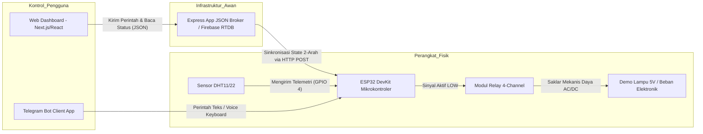
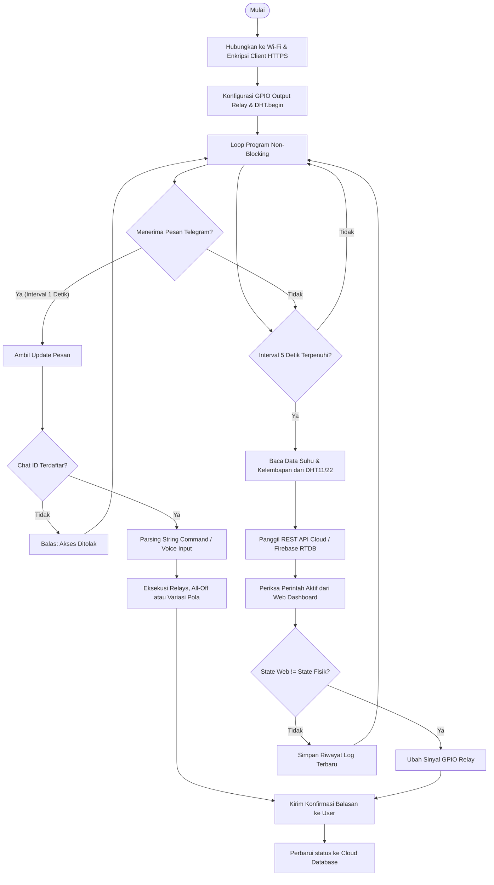

# Smart Home IoT 4-Relay Ecosystem with Telegram Bot & Web Dashboard

Ekosistem Internet of Things (IoT) berbasis mikrokontroler **ESP32 DevKit V1**, **Sensor DHT11/DHT22**, **Relay 4-Channel**, **Telegram Bot**, dan **Web Dashboard Interaktif**. Sistem ini memungkinkan kontrol peralatan listrik rumah tangga secara aman dan real-time dari mana saja menggunakan Web App maupun pesan Teks & Voice Typing di Telegram Bot.

---

## 🌟 Fitur Utama

- **Web Dashboard Modern & Responsive**: Penuh gaya, minimalis, dan clean yang dikustomisasi dengan parameter sensor suhu dan kelembapan real-time.
- **Bi-directional Cloud Synchronization**: Menghubungkan perintah saklar relay dan telemetri DHT sehingga perubahan di Telegram atau di web akan langsung tersinkronisasi.
- **Interaksi Telegram Bot Komplit**: Dikembangkan dengan pustaka `UniversalTelegramBot` mendukung operasi:
  - `/start` - Menampilkan menu utama bantuan.
  - `/status` - Cek menyeluruh status relay 1 - 4 dan parameter sensor.
  - `/sensor` - Laporan suhu dan kelembapan terkini.
  - `/all_on` & `/all_off` - Mengendalikan seluruh beban elektrik secara kolektif.
  - Pola `/variasi1` & `/variasi2` untuk pengedipan beruntun sekuensial.
- **Dukungan Voice-to-Text**: Mendukung kontrol asisten suara menggunakan keyboard voice typing/speech-to-text pada smartphone.
- **Dynamic IDE Code Generator**: Tab khusus **Generator Kode** di dalam Web Dashboard yang otomatis menginjeksi pengaturan Wi-Fi SSID, Password, Token Bot, dan Firebase URL Anda tanpa perlu konfigurasi manual dari nol di file C++ (.ino).
- **Simulator Hardware Interaktif**: Terintegrasi langsung dengan simulator perangkat keras dalam antarmuka Web Console, ideal untuk pengujian program atau simulasi kegagalan koneksi tanpa harus selalu menyambungkan perangkat ESP32 fisik.

---

## 📐 Skema Blok Diagram & Topologi Sistem

### 1. Blok Diagram Fisik
Sistem IoT ini dibagi menjadi tiga lapisan arsitektonik yang terikat:



### 2. Alur Jalannya Program (Flowchart)



---

## 🔌 Konfigurasi Pin Fisik ESP32

Secara default, skema pemasangan kabel GPIO ESP32 DevKit V1 direferensikan sebagai berikut:

| Nama Komponen | Spesifikasi / Tipe | Pin GPIO ESP32 | Keterangan |
|---|---|---|---|
| **Sensor Suhu** | DHT11 atau DHT22 | **GPIO 4 (PWM)** | Sambungkan resistor 10k Ohm pull-up di VCC ke PIN Data (Opsional) |
| **Relay 1 (Lampu 1)**| Relay Module Active LOW | **GPIO 16 (TX2)** | Logika LOW = ON, HIGH = OFF |
| **Relay 2 (Lampu 2)**| Relay Module Active LOW | **GPIO 17 (RX2)** | Logika LOW = ON, HIGH = OFF |
| **Relay 3 (Lampu 3)**| Relay Module Active LOW | **GPIO 18 (VSPI SCK)**| Logika LOW = ON, HIGH = OFF |
| **Relay 4 (Lampu 4)**| Relay Module Active LOW | **GPIO 19 (VSPI MISO)**| Logika LOW = ON, HIGH = OFF |
| **Catu Daya** | USB Adaptor HP 5V 2A | **VIN & GND** | Menghidupkan modul relay & ESP32 secara stabil |

---

## 💾 Petunjuk Instalasi Proyek

### 1. Web Dashboard (Node.js & Tailwind CSS)
Pastikan komputer atau server cloud Anda sudah terpasang Node.js (Versi 18+ direkomendasikan).

```bash
# 1. Masuk ke direktori utama projek
cd smart-home-iot-relay

# 2. Pasang dependensi dari package.json
npm install

# 3. Jalankan server pengembangan lokal (Express + Vite Server di Port 3000)
npm run dev
```

### 2. Mempersiapkan Bot Telegram di Smartphone
1. Cari `@BotFather` pada aplikasi Telegram Anda.
2. Kirim perintah `/newbot` lalu ikuti langkah pembuatan nama bot dan username.
3. Salin token HTTPS API Bot yang dikeluarkan (Contoh: `7394850285:AAFlk_vE-Y88...`).
4. Untuk mendapatkan `CHAT_ID` pribadi Anda, cari bot `@myidbot` atau `@RawDataBot` di Telegram lalu kirim perintah `/getid`. Catat nomor angka ID tersebut.
5. Tempel nilai Token dan Chat ID ini langsung ke formulir **Settings (Setelan Bot)** di dalam Web Dashboard untuk meng-generate kodingan ESP32 secara otomatis.

---

## 🛠️ Langkah Menghubungkan ke Firebase Realtime Database
1. Buka [Firebase Console](https://console.firebase.google.com/) dan buat project baru.
2. Pada menu sidebar, pilih **Build > Realtime Database**, lalu klik **Create Database**.
3. Pilih lokasi server database terdekat dan pilih **Test Mode** agar aturan keamanan awal terbuka untuk dibaca/tulis (`.read: true`, `.write: true`).
4. Salin URL database Anda (Contoh: `https://your-project-id-default-rtdb.firebaseio.com/`).
5. Dapatkan secret key database dengan membuka **Project Settings > Service Accounts > Database Secrets**.
6. Masukkan kedua nilai tersebut ke dashboard atau buat file `.env` untuk integrasi awan tanpa hambatan.

---

## ⚡ Keselamatan Kerja Listrik AC 220V

> [!WARNING]
> Tegangan listrik AC 220V bersifat fatal dan dapat mengakibatkan luka bakar serius atau kematian jika salah penanganan.
> - **Selalu lakukan wiring/pemasangan kabel dalam kondisi saklar colokan utama PLN terputus.**
> - Pastikan semua bagian terminal terminal modul relay terisolasi dengan rapi menggunakan selongsong bakar atau lakban listrik.
> - Kami merekomendasikan penggunaan sasis plastik (box hitam X6) sebagai wadah aman dari jangkauan tidak sengaja.
> - **Untuk demonstrasi di kampus atau uji coba praktikum laboratorium, disarankan sepenuhnya memakai lampu simulasi DC 5V atau 12V yang jauh lebih aman.**

---

## 👥 Tim Penilai & Kontributor
- **Penguji / Assessor**: `Veryn` (dan Quiz IoT Assessor Team)
- **Email Kontak**: `veybilly285@gmail.com`

---
*Proyek ini merupakan bukti otentik penguasaan materi perkuliahan Sistem IoT Terapan dengan integrasi cloud database real-time dan asisten asinkron chatbot.*
